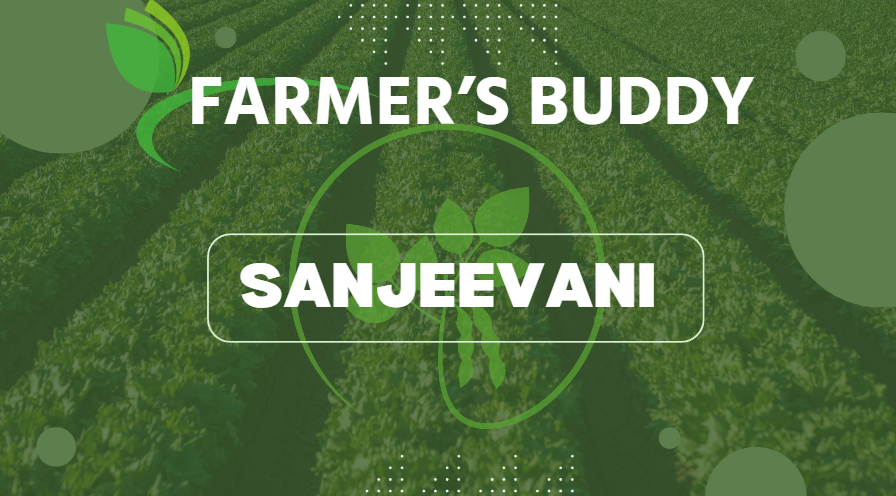

# Sanjeevani 

Sanjeevani is an application meant for farmers from rural areas. it will diagnose the plant disease and give a solution for it, and a buddy, as it will help interact their problems with people.
Sanjeevani stands out with its unique feature of full voice control, making it accessible across a variety of languages.

[View Demo of Application](https://www.youtube.com/watch?v=ynv-kJ4FyVw)

- dl_app - Contains Android Application
- notebooks - Contains model and notebook files for Training

## Features

- Disease Prediction Model - Upload photo of crop, model will detect the Disease.

## Tech Stack

**Backend:** Deep Learning, Tensorflow, ResNet50

**Platform:** Android Studio, Java

[Dataset for Training](https://www.kaggle.com/datasets/vipoooool/new-plant-diseases-dataset)

